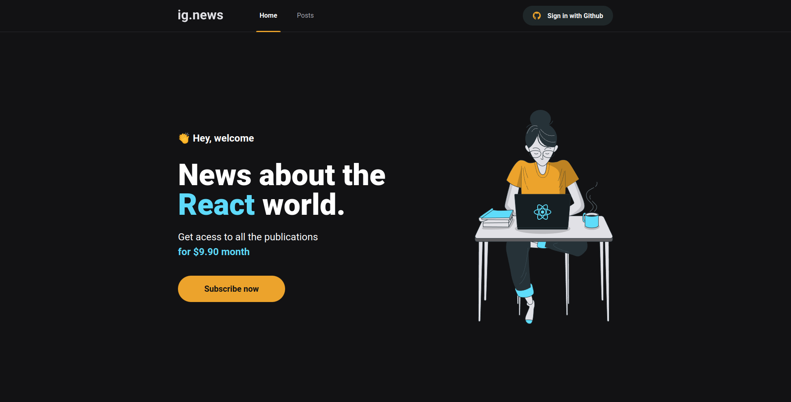
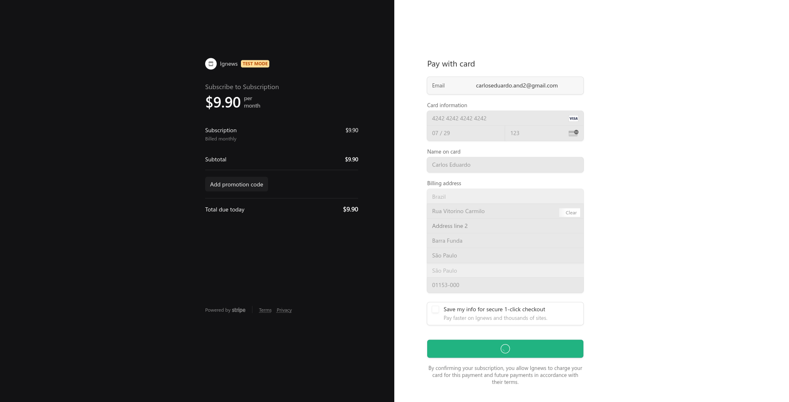
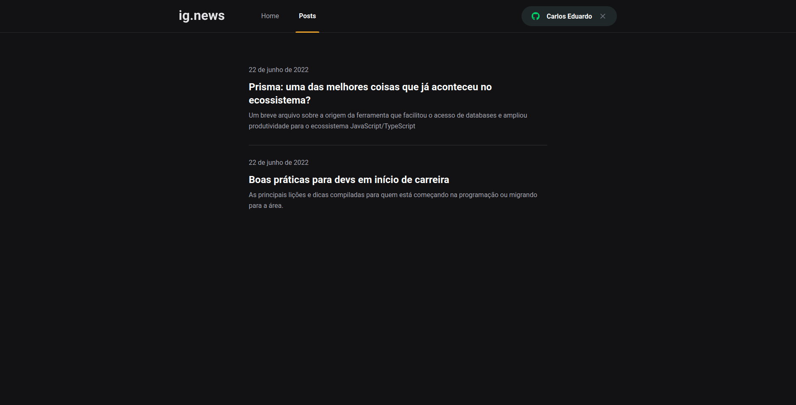
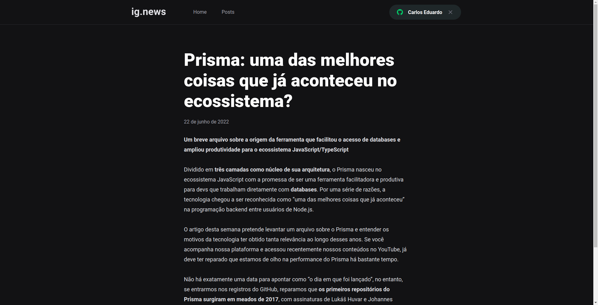

<h1 align="center">


</h1>

<p align="center">
  <h1 align="center"> Ignews - Portal de notícias 📰🚀 </h1>
</p>

<p align="center">
  <a href="#dart-sobre">Sobre</a> &#xa0; | &#xa0; 
  <a href="#rocket-tecnologias">Tecnologias</a> &#xa0; | &#xa0;
  <a href="#white_check_mark-requerimentos">Requerimentos</a> &#xa0; | &#xa0;
  <a href="#checkered_flag-começando">Começando</a> &#xa0; &#xa0;
</p>

<br>

## :dart: Sobre ##

<p>
  O ignews é um portal de notícias no qual os usuários pagam para ter acesso. 
  o usuário só tem acesso das postagens caso ele tenha uma inscrição ativa no Stripe. 
  caso o usuário não seja inscrito, poderá ler apenas um resumo das postagens.
</p>
<p>
  Os meios de pagamento da aplicação são integrados com a API do Stripe, juntamente
  do FaunaDB para armazenar as informações dos usuários. as postagens são administradas
  através do CMS Prismic.io 
</p>
<p>A aplicação é construída com modelo <strong>Serveless</strong>, sem necessidade de criar uma API externa para manipular os dados</p>

<p>
  
  
  
  
</p>

## :rocket: Tecnologias ##

As seguintes tecnologias foram utilizadas no projeto:

- [Next.js](https://nextjs.org/)
- [Prismic CMS](https://prismic.io/)
- [Stripe](https://stripe.com/)
- [FaunaDB](https://fauna.com/)

## :white_check_mark: Requerimentos ##

- [Node](https://nodejs.org/en/)
- [Yarn](https://yarnpkg.com/lang/en/)

## :checkered_flag: Começando ##

```bash
# Clone this project
$ git clone https://github.com/khalleb/ignews
# Access
$ cd ignews
# Install dependencies
$ yarn install
# Run the project
$ yarn dev
# The server will initialize in the <http://localhost:3000>
```
